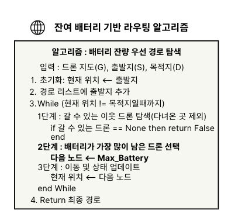
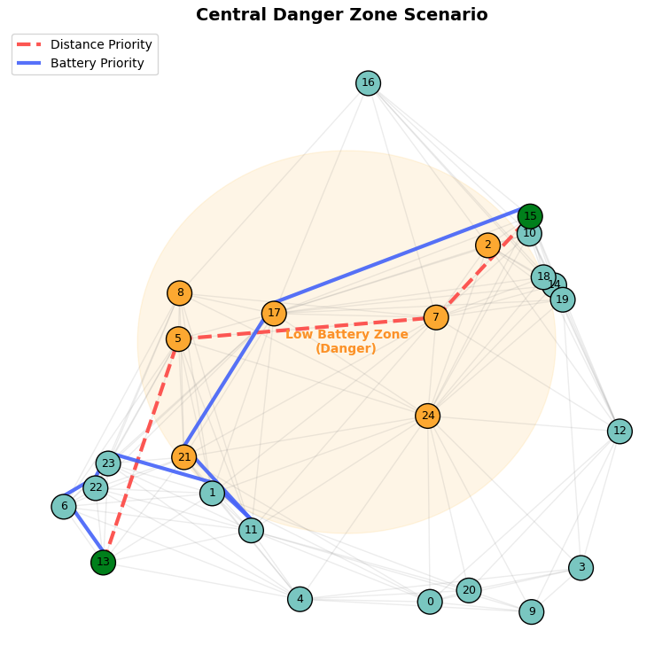

# CN_Project

### 2025-2 CN 프로젝트

#### 🛸 다중 드론 시뮬레이션 기반 라우팅 알고리즘 성능 비교
- 비교군 : 기존의 **거리우선 알고리즘(다익스트라)과 새로운 알고리즘(배터리 잔량 우선순위 선정 알고리즘)**

👩🏻‍💻 Our Team 🧑🏻‍💻
-------------

| **이름** | **역할** |
|:---:|:---:|
| 박민영 | 실험 설계 및 데이터 분석 |
| 신지아 | 라우팅 알고리즘 설계 및 적용 |
| 진성민 | 시뮬레이션 환경 코딩(다중 드론 환경 구현) |
| 정준혁 | 결과 시각화 및 PPT 제작 |

💻 Environment
---------------
- Language : Python

Battery-Aware Algorithm
------------------------
- 배터리 잔량 기반 알고리즘 : **가장 배부른 놈한테 먼저 연결합니다**
- pseudo code는 다음과 같습니다.

Performance Validation
------------------------

